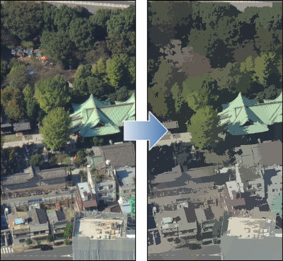
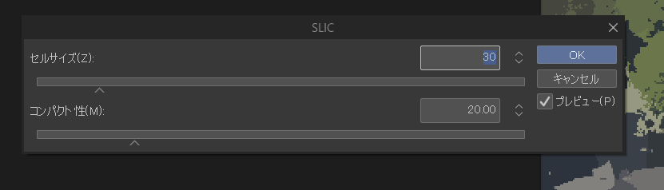

# 動作確認済OS

- Windows：11 Pro 64bit版

# 適用できる対象レイヤー

- ラスターレイヤー（カラー）

# プラグイン概要

SLIC (Simple Linear Iterative Clustering) アルゴリズムを用いたスーパーピクセル分割フィルターです。
画像を色や距離の似た領域（スーパーピクセル）ごとに分割し、平均化することで、独特な多角形風・ステンドグラス風の加工効果が得られます。

写真などの高密度の情報量を持つ素材から適度に情報量を削減したい時などに利用できます。

# プラグインを利用した際（適用前→適用後 等）のイメージ画像

# プラグインの使用方法

## 1. SLICを実行する。

2.1 「フィルター」→ 「SLICフィルター」→ 「SLIC」を選択

2.2 パラメータの設定

- **セルサイズ**: 分割する領域の細かさを指定します。
- **コンパクト性**: 領域の形状の規則正しさを指定します。値が大きいほど均一な形状になり、小さいほど画像のエッジ（境界線）に追従しやすくなります。

-----

# 備考
このフィルターの癖についての説明。

### パフォーマンスについて

このフィルターの計算量は大きいため、処理に時間がかかります。 
セルサイズが小さくなるほど時間が増加します。コンパクト性が小さいほど時間が増加します。

----

### 開発情報

https://github.com/Dolphin-AKI/CLIPPlugin-SLIC
